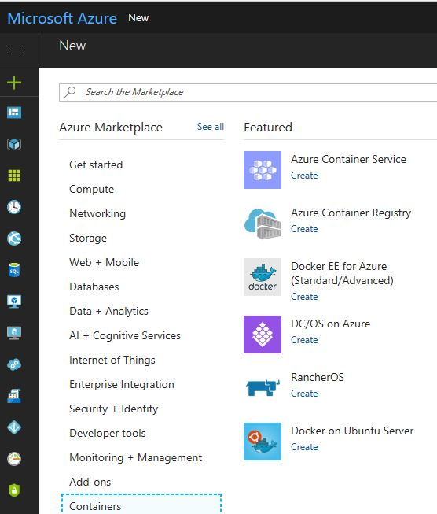
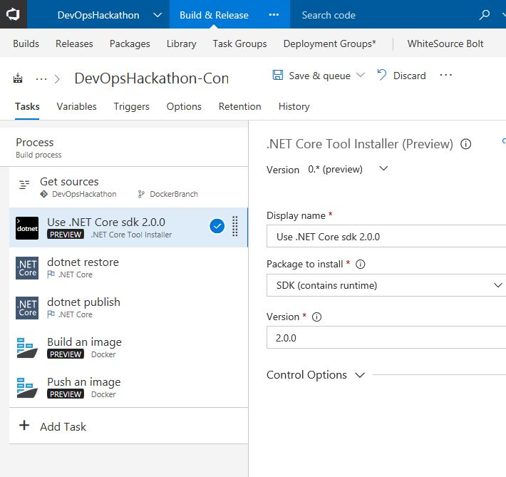
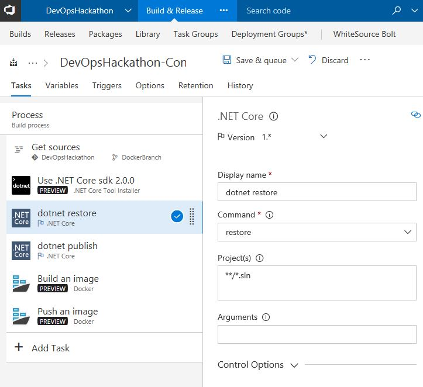
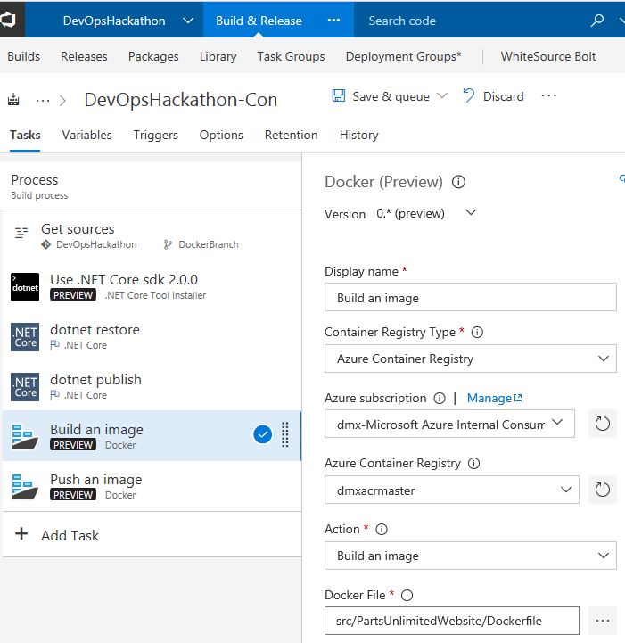
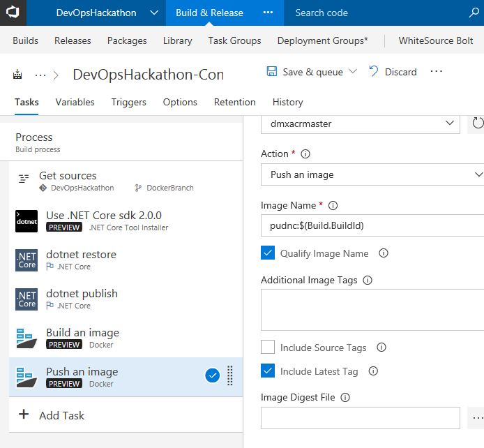

#  Containers
This is not a step-by-step guide. Instead it's a collection of screenshots which will help you complete the DevOpsHack challenges.
This is on purpose: We want you to explore and play with the different options of VSTS. 

## Add a docker file
An appropriate dockerfile for your application could look like this. Just add it in the root of the WebApplication and name it "Dockerfile"
```
FROM microsoft/aspnetcore:1.0.5
WORKDIR /app
EXPOSE 80
COPY bin/Debug/netcoreapp1.0/publish /app
ENTRYPOINT ["dotnet", "PartsUnlimitedWebsite.dll"]
```

In case you have Docker installed locally first build your application for publishing. This puts the app and all dependencies into a folder called "publish" per default.
```
dotnet publish
```
Then run the docker command to build the docker container from within the folder with the Dockerfile. 
```
docker build -t partsunlimitedwebsite .
```
You can look for the container on your local machine using the following command:
```
docker images
```
Then run the container locally.
```
docker run -d -p 8080:80 partsunlimitedwebsite
```
If you run this locally it will start up your website in your container.

## Create an Azure Container Registry in Azure Portal


## Create a build definition to create a container
1. Choose Hosted Linux agents as build agents.
1. They might need an updated version of Dotnet SDK. You can find a build task to update the SDK on the agent. Choose Version 2.0.0.

1. Run *dotnet restore* and *dotnet publish* on the agent.

1. Use the Docker tasks to build an image. 

1. Use the Docker tasks to publish the image.



## Run image locally
Login to your Azure Container Registry. You can find username and password in the Azure portal.
```
docker login yourregistry.io --username <USERNAME> --password <PASSWORD>
```
Run the image.
```
docker run -d -p 8080:80 <yourFullyQualifiedImageNameIncludingRegistryName>:<yourtag>
```

## Run image in Azure Container Instances
1. Open Azure Portal and open up cloud shell.

1. Run this command to create a resource group.
```
az group create --name YOURRESOURCEGROUP --location eastus
```
1. Run this command to create an instance of your container image provided in your Azure Container Registry.
```
az container create --name YOURCONTAINERNAME --image YOURFULLYQUALIFIEDIMAGENAME --resource-group YOURRESOURCEGROUP --ip-address public --registry-login-server YOURLOGINSERVEr --registry-username YOURREGISTRYUSER --registry-password YOURPW
```
1. Run this command to query deployment state. If the container is running visit the public URL to view your application.
```
az container show --name YOURCONTAINERNAME --resource-group YOURRESOURCEGROUP
```

## Depoy to ACI from VSTS
1. Create a new Release Definition
1. Add a new task to your release and to run a powershell script. Run the command as specified previously and also run "az login" before as described [here](../ApplicationMonitoring/ApplicationMonitoring.md).


